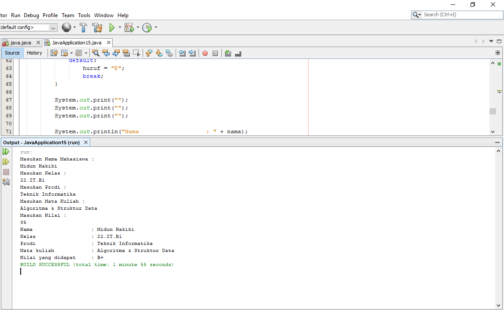

# JAVA IF MENGUBAH MENJADI SWITCH

    /*
    * To change this license header, choose License Headers in Project Properties.
    * To change this template file, choose Tools | Templates
    * and open the template in the editor.
    */
    package javaapplication15;

    import java.util.Scanner;

    public class JavaApplication15 {

        /**
        * @param args the command line arguments
        */
        public static void main(String[] args) {
            // TODO code application logic here
        
            String huruf, nama, kelas, matkul, prodi;
            int nilai;

            //menginput data
            Scanner sc = new Scanner(System.in);
            System.out.println("Masukan Nama Mahasiswa : ");
            nama = sc.nextLine();
            System.out.println("Masukan Kelas : ");
            kelas = sc.nextLine();
            System.out.println("Masukan Prodi : ");
            prodi = sc.nextLine();
            System.out.println("Masukan Mata Kuliah : ");
            matkul = sc.nextLine();
            System.out.println("Masukan Nilai : ");
            nilai = sc.nextInt();

            // melakukan pengecekan nilai menggunakan nilai menggunakan switch

        switch (nilai) {
            case 100:
                huruf = "A+";
                break;
            case 90:
                huruf = "A+";
                break;
            case 97:
                huruf = "A";
                break;
            case 85:
                huruf = "B+";
                break;
            case 80:
                huruf = "B";
                break;
            case 70:
                huruf = "c";
                break;
            case 60:
                huruf = "D";
                break;
            default:
                huruf = "E";
                break;
        }

        System.out.print("");
        System.out.print("");
        System.out.print("");

        System.out.println("Nama                   : " + nama);
        System.out.println("Kelas                  : " + kelas);
        System.out.println("Prodi                  : " + prodi);
        System.out.println("Mata kuliah            : " + matkul);
        System.out.println("Nilai yang didapat     : " + huruf);

    }
}
        
* Dan ini hasilnya setelah di terminal/Run
  

        
        
 #  TERIMAKASIH...       
        
        
        
        
       